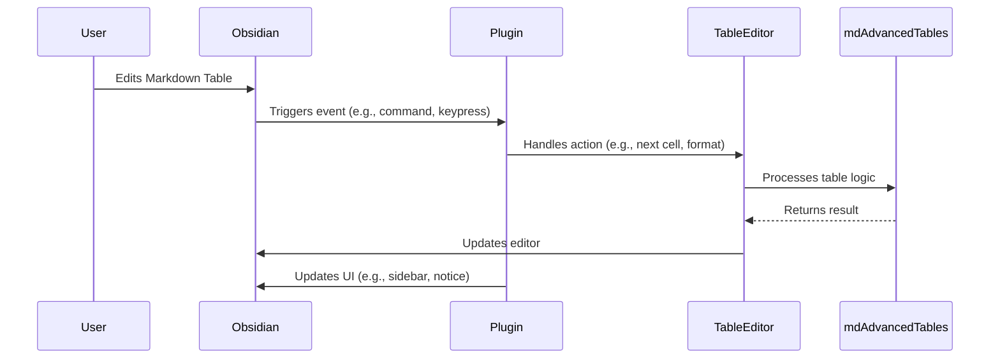

# Advanced Tables for Obsidian — Comprehensive Codebase Overview

## Table of Contents
1. [Product Overview](#product-overview)
2. [Key Features](#key-features)
3. [System Architecture](#system-architecture)
    - [Component Diagram (Mermaid)](#component-diagram-mermaid)
    - [Core Data Flow](#core-data-flow)
4. [Source Structure](#source-structure)
5. [Core Modules & Responsibilities](#core-modules--responsibilities)
6. [Plugin Lifecycle & Extension Points](#plugin-lifecycle--extension-points)
7. [User Experience & Product Considerations](#user-experience--product-considerations)
8. [Build, Tooling & Deployment](#build-tooling--deployment)
9. [Contribution & Community](#contribution--community)
10. [Appendix: Versioning, Licensing, and Funding](#appendix-versioning-licensing-and-funding)

---

## Product Overview

**Advanced Tables for Obsidian** is a feature-rich plugin that enhances Markdown table editing in Obsidian. It introduces spreadsheet-like navigation, auto-formatting, advanced manipulation, and formula support, all while maintaining Markdown compatibility.

---

## Key Features
- **Auto-formatting** of Markdown tables
- **Excel-like navigation** (Tab/Enter between cells/rows)
- **Spreadsheet formulas**
- **Column/row add, remove, move**
- **Column alignment** (left, center, right)
- **Sorting** by column
- **CSV export**
- **Mobile support**
- **Sidebar controls** with visual toolbar

---

## System Architecture

### Component Diagram (Mermaid)
```mermaid
graph TD
    A[Obsidian App]
    B[Advanced Tables Plugin]
    C[TableControlsView]
    D[TableEditor]
    E[Settings]
    F[ObsidianTextEditor]
    G[md-advanced-tables (external)]
    H[UI (Sidebar, Toolbar, CSS)]
    I[Icons/SVG]

    A -->|Loads| B
    B -->|Registers| C
    B -->|Instantiates| D
    B -->|Loads| E
    D -->|Uses| F
    D -->|Uses| G
    C -->|Renders| H
    H -->|Uses| I
```

### Core Data Flow


---

## Source Structure

```
advanced-tables-obsidian-main/
├── src/
│   ├── main.ts                # Plugin entrypoint, lifecycle, registration
│   ├── settings.ts            # Settings schema & logic
│   ├── table-controls-view.ts # Sidebar/toolbar UI
│   ├── table-editor.ts        # Table manipulation logic (wrapper)
│   ├── obsidian-text-editor.ts# Adapter for Obsidian's editor
│   └── icons.ts               # SVG icons, icon registration
├── resources/
│   ├── line-widget-icons/     # SVGs for toolbar
│   └── screenshots/           # Demo images/gifs
├── styles.css                 # Custom plugin styles
├── docs/help.md               # User help & formulas
├── package.json               # NPM metadata, dependencies
├── manifest.json              # Obsidian plugin manifest
├── esbuild.config.mjs         # Build config
├── README.md                  # User/installation guide
├── ... (other config files)
```

---

## Core Modules & Responsibilities

### 1. `src/main.ts` (Plugin Entrypoint)
- Registers the plugin with Obsidian
- Loads/saves settings
- Registers commands (e.g., next cell, format table)
- Registers sidebar view (`TableControlsView`)
- Integrates with Obsidian's plugin API

### 2. `src/settings.ts`
- Defines settings schema (`ISettings`, `TableEditorPluginSettings`)
- Handles loading, saving, and default values
- Exposes settings to other modules

### 3. `src/table-controls-view.ts`
- Implements the sidebar/toolbar UI
- Renders buttons for table actions (align, move, edit, sort, formula, export)
- Connects UI actions to table logic

### 4. `src/table-editor.ts`
- Wraps the core table logic from `md-advanced-tables`
- Adapts plugin settings to table operations
- Handles all table manipulation commands
- Exposes methods for navigation, formatting, editing, sorting, formulas, and export

### 5. `src/obsidian-text-editor.ts`
- Adapts Obsidian's editor to the interface expected by `md-advanced-tables`
- Handles cursor, selection, text manipulation
- Ensures compatibility with Obsidian's file and metadata APIs

### 6. `src/icons.ts` & `resources/line-widget-icons/`
- SVG icon definitions for toolbar and UI
- Registers icons with Obsidian

---

## Plugin Lifecycle & Extension Points

- **Activation**: Plugin is loaded by Obsidian; registers settings, commands, and views
- **Settings**: Exposed via Obsidian settings tab (`TableEditorSettingsTab`)
- **Commands**: Many actions are available via command palette and hotkeys
- **Sidebar/Toolbar**: Visual controls for all major table actions
- **Integration**: Uses `@tgrosinger/md-advanced-tables` for table logic (formulas, formatting, etc.)
- **Mobile**: Special handling for mobile toolbar

---

## User Experience & Product Considerations

- **Target Users**: Obsidian users who work extensively with Markdown tables and want spreadsheet-like features
- **Value Proposition**: Bridges the gap between Markdown and spreadsheet usability
- **Safety**: Warns users about experimental features and potential data loss (see README)
- **Accessibility**: Toolbar, hotkeys, and command palette support
- **Documentation**: Rich README, help docs, and in-app help
- **Monetization**: Free, but encourages donations (GitHub Sponsors, PayPal, BuyMeACoffee)

---

## Build, Tooling & Deployment

- **Build**: Uses `esbuild` (see `esbuild.config.mjs`)
- **TypeScript**: Strongly typed, configured via `tsconfig.json`
- **Linting/Formatting**: ESLint, Prettier
- **Dependencies**:
    - `@tgrosinger/md-advanced-tables` (core logic)
    - `obsidian` (plugin API)
    - `@codemirror/state`/`view` (editor extensions)
- **Distribution**: Packaged for Obsidian Community Plugins, installable via Obsidian or GitHub

---

## Contribution & Community

- **Open Source**: Licensed under GPL-3.0
- **Contributions**: Issues & PRs via GitHub
- **Community**: GitHub, Obsidian Discord (maintainer: tgrosinger)
- **Funding**: See `manifest.json` and README for donation links

---

## Appendix: Versioning, Licensing, and Funding

- **Versioning**: Follows plugin and Obsidian compatibility versions (see `versions.json`)
- **License**: GPL-3.0 (see LICENSE)
- **Funding**: [GitHub Sponsors](https://github.com/sponsors/tgrosinger), [PayPal](https://paypal.me/tgrosinger), [BuyMeACoffee](https://buymeacoffee.com/tgrosinger)

---

*Generated on 2025-06-07. For the latest details, see the README and in-app help.*
